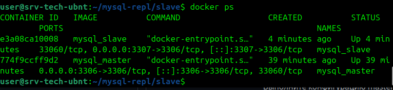
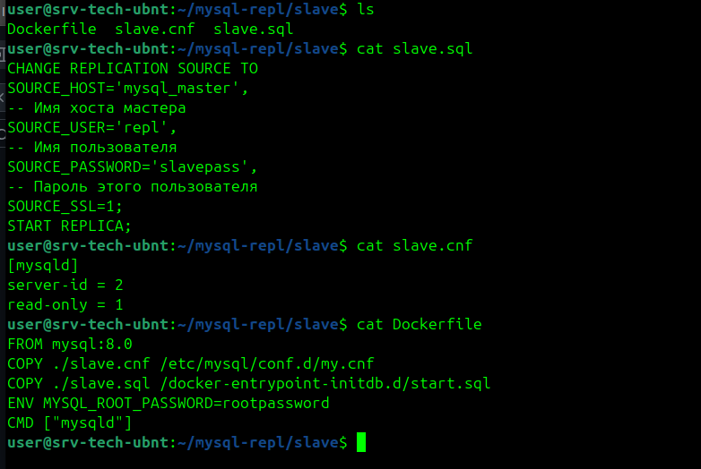
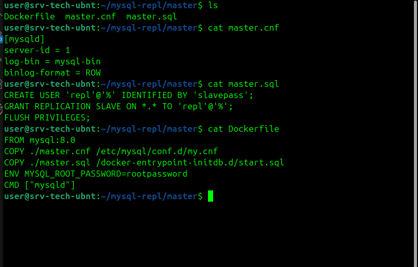
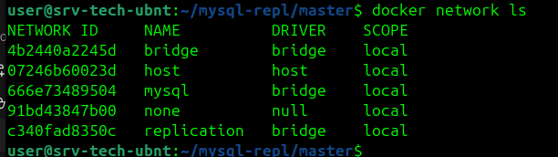
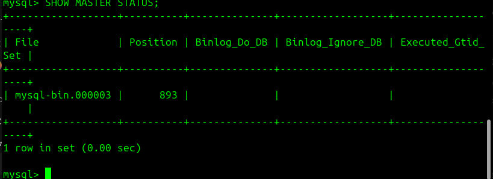
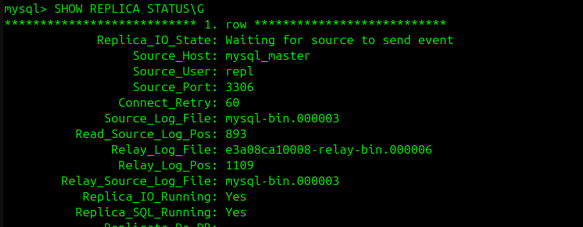
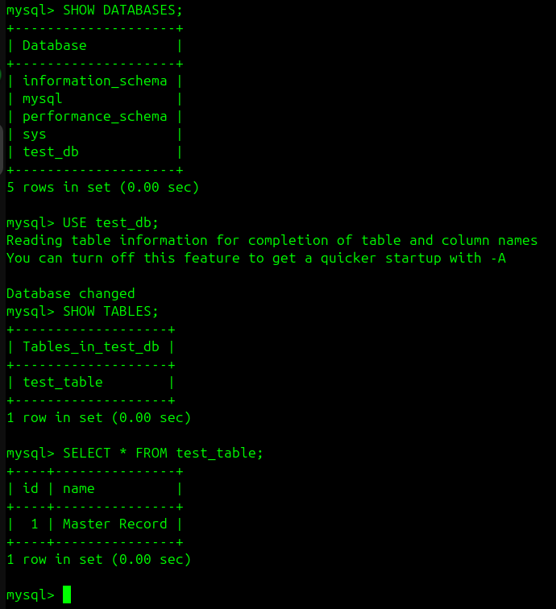

# Домашнее задание к занятию «Репликация и масштабирование. Часть 1» - Харьков Никита

### Задание 1

На лекции рассматривались режимы репликации master-slave, master-master, опишите их различия.

*Ответить в свободной форме.*

---
### Решение 1

## Репликация master-master:   

Все серверы равноправны — каждый является
одновременно и мастером, и слейвом для другого. Запросы на запись или
чтение можно отправлять на любой из серверов, и изменения будут
распространены на все остальные.

## Репликация master-slave:

Есть один главный сервер и
один или несколько подчинённых

---
### Задание 2

Выполните конфигурацию master-slave репликации, примером можно пользоваться из лекции.
Приложите скриншоты конфигурации, выполнения работы: состояния и режимы работы серверов.

---
### Решение 2

**Запущенные контейнеры master и slave**

**Конфиг slave**

**Конфиг master**

**Настроенная отдельная сеть**

**Мастер bin лог**

**Параметры и состояние репликации на slave**

**Тест работы master-slave**
